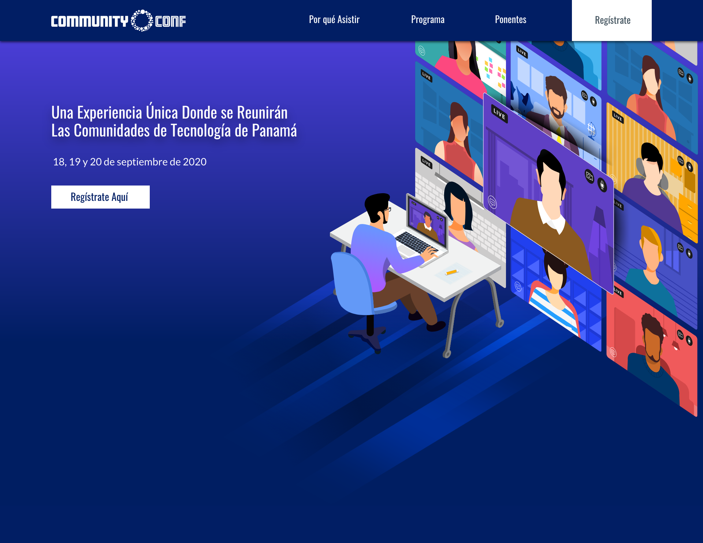

[](https://travis-ci.org/Automattic/_s)

CommunityConf2020
===

Este es el tema personalizado para la CommunityConf 2020, Ciudad de Panamá.
Está basado en el tema _S de Automattic.



Instalación
---------------

### Requirements

`_s` Requiere de las siguientes dependencias:

- [Node.js](https://nodejs.org/)
- [Composer](https://getcomposer.org/)

### Quick Start

Clona el repo y cambiale el nombre. Luego correo npm install.

### Cómo instalar en WordPress

1. Baja el tema en formato .zip
1. En el panel de administración ir a Apariencia > Temas y click en Añadir Nuevo.
1. Click al botón Subir tema y elegir el archivo .zip del tema y dar click en Instalar Ahora.
1. Click en Activar Tema.

### Configuración

Para usar las herramientas necesitas instalar las dependencias con composer y npm:

```sh
$ composer install
$ npm install
```

### Comandos de CLI disponibles

Estos son los comandos de CLI disponibles con _s
Directamente desde la documentación de _s:

`_s` comes packed with CLI commands tailored for WordPress theme development :

- `composer lint:wpcs` : checks all PHP files against [PHP Coding Standards](https://developer.wordpress.org/coding-standards/wordpress-coding-standards/php/).
- `composer lint:php` : checks all PHP files for syntax errors.
- `composer make-pot` : generates a .pot file in the `languages/` directory.
- `npm run compile:css` : compiles SASS files to css.
- `npm run compile:rtl` : generates an RTL stylesheet.
- `npm run watch` : watches all SASS files and recompiles them to css when they change.
- `npm run lint:scss` : checks all SASS files against [CSS Coding Standards](https://developer.wordpress.org/coding-standards/wordpress-coding-standards/css/).
- `npm run lint:js` : checks all JavaScript files against [JavaScript Coding Standards](https://developer.wordpress.org/coding-standards/wordpress-coding-standards/javascript/).
- `npm run bundle` : generates a .zip archive for distribution, excluding development and system files.

Now you're ready to go! The next step is easy to say, but harder to do: make an awesome WordPress theme. :)

Good luck!
